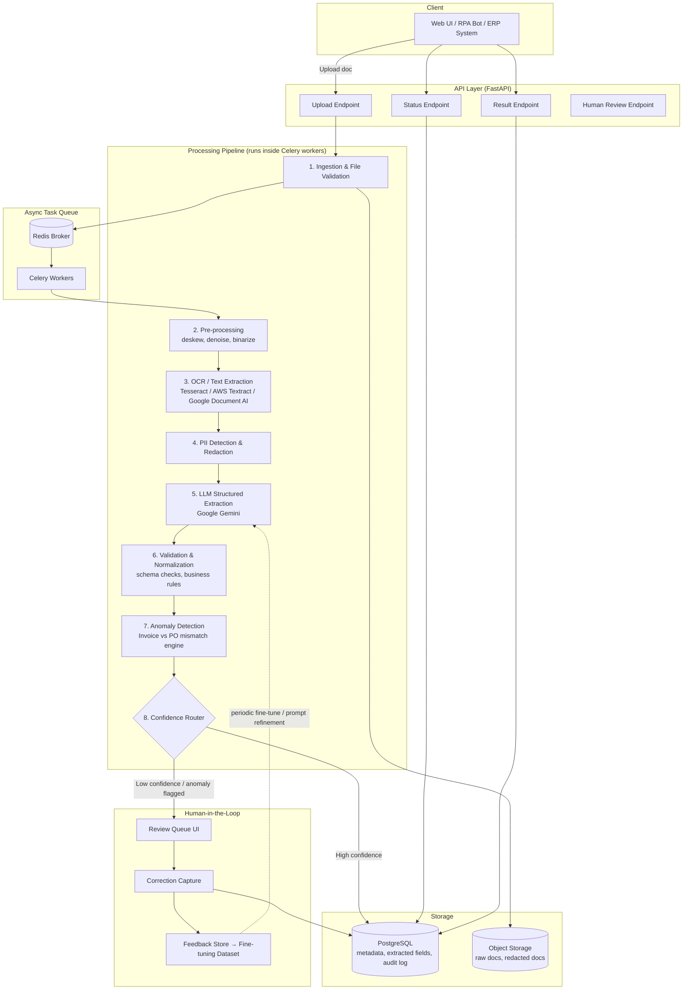

# Intelligent Document Processing (IDP) Pipeline
### System Design & Implementation Guide
**Author role:** Senior AI/ML Architect & Full-Stack Engineer
**Project:** Standalone IDP microservice — invoice / purchase order / receipt processing with anomaly detection and human-in-the-loop learning

> **Scope note:** Since this is a fresh internship project rather than an integration into an existing codebase, this design treats the IDP pipeline as a **standalone service** exposing a clean REST API — so it can be plugged into any existing app (RPA bot, ERP, internal portal) later with minimal friction. Swap in your actual project's auth/DB layer when you integrate.

---

## 1. High-Level Architecture



**Why this shape:**
- Upload returns immediately (async) — the caller polls `/status` or gets a webhook, which is how real document volumes (hundreds/thousands per hour) have to work.
- Every stage writes an audit trail to Postgres, so you can show *why* a document was flagged, not just that it was — this matters a lot when you demo it to non-ML stakeholders.
- The anomaly detector and confidence router are what make this "IDP" rather than "OCR script" — they decide what a human actually needs to look at.

---

## 2. Tech Stack

| Layer | Choice | Why |
|---|---|---|
| API | Python 3.11 + FastAPI | async-native, auto OpenAPI docs, easy to plug into any frontend |
| Task Queue | Celery + Redis (broker & result backend) | battle-tested for document-volume async workloads |
| OCR | Tesseract (local/free) with an adapter interface so you can swap in AWS Textract / Google Document AI later | keeps the project runnable without cloud credentials, but production-realistic |
| Structured Extraction | Google Gemini via the Gemini API | handles messy/varied layouts far better than regex, and gives you reasoning you can log |
| Database | PostgreSQL | relational integrity for line items, audit trail, vendor master data |
| Object Storage | S3-compatible (or local disk with same interface for dev) | raw + redacted document versions |
| PII Redaction | Presidio (Microsoft's open-source PII detection) or a regex/NER hybrid | needed before docs touch any LLM or log |
| Monitoring | Prometheus + Grafana, structured logging (JSON via `structlog`) | field-extraction accuracy and latency dashboards |

---

## 3. Database Schema (core tables)

```sql
CREATE TABLE documents (
    id UUID PRIMARY KEY DEFAULT gen_random_uuid(),
    filename TEXT NOT NULL,
    doc_type TEXT,                    -- 'invoice' | 'purchase_order' | 'receipt'
    status TEXT NOT NULL DEFAULT 'pending',  -- pending|processing|needs_review|completed|failed
    s3_raw_path TEXT NOT NULL,
    s3_redacted_path TEXT,
    uploaded_at TIMESTAMPTZ DEFAULT now(),
    processed_at TIMESTAMPTZ,
    confidence_score FLOAT,
    retry_count INT DEFAULT 0
);

CREATE TABLE extracted_fields (
    id UUID PRIMARY KEY DEFAULT gen_random_uuid(),
    document_id UUID REFERENCES documents(id),
    field_name TEXT NOT NULL,         -- 'vendor_name', 'total_amount', 'invoice_date', ...
    field_value TEXT,
    confidence FLOAT,
    source TEXT DEFAULT 'llm',        -- 'llm' | 'human_correction'
    bounding_box JSONB                -- for UI highlight overlay
);

CREATE TABLE line_items (
    id UUID PRIMARY KEY DEFAULT gen_random_uuid(),
    document_id UUID REFERENCES documents(id),
    description TEXT,
    quantity NUMERIC,
    unit_price NUMERIC,
    line_total NUMERIC
);

CREATE TABLE anomalies (
    id UUID PRIMARY KEY DEFAULT gen_random_uuid(),
    document_id UUID REFERENCES documents(id),
    anomaly_type TEXT,                -- 'total_mismatch' | 'po_not_found' | 'price_deviation' | 'duplicate_invoice'
    severity TEXT,                    -- 'low' | 'medium' | 'high'
    details JSONB,
    resolved BOOLEAN DEFAULT FALSE
);

CREATE TABLE human_corrections (
    id UUID PRIMARY KEY DEFAULT gen_random_uuid(),
    document_id UUID REFERENCES documents(id),
    field_name TEXT,
    original_value TEXT,
    corrected_value TEXT,
    reviewer TEXT,
    corrected_at TIMESTAMPTZ DEFAULT now()
);
```

---

## 4. Core Pipeline Code

### 4.1 Project structure

```
idp_pipeline/
├── app/
│   ├── main.py                 # FastAPI app & routes
│   ├── celery_app.py           # Celery configuration
│   ├── tasks.py                # Async pipeline tasks
│   ├── services/
│   │   ├── ingestion.py
│   │   ├── preprocessing.py
│   │   ├── ocr.py
│   │   ├── pii_redaction.py
│   │   ├── llm_extraction.py
│   │   ├── validation.py
│   │   └── anomaly_detection.py
│   ├── models/
│   │   └── db_models.py        # SQLAlchemy models
│   ├── schemas/
│   │   └── api_schemas.py      # Pydantic request/response models
│   └── core/
│       ├── config.py
│       └── logging_config.py
├── requirements.txt
└── docker-compose.yml
```

### 4.2 API Layer — `app/main.py`

```python
from fastapi import FastAPI, UploadFile, File, HTTPException, Depends
from uuid import UUID
import uuid, aiofiles, os

from app.celery_app import celery_app
from app.tasks import process_document_pipeline
from app.schemas.api_schemas import DocumentStatusResponse, DocumentResultResponse
from app.core.logging_config import get_logger

logger = get_logger(__name__)
app = FastAPI(title="IDP Pipeline API", version="1.0.0")

UPLOAD_DIR = "storage/raw"
os.makedirs(UPLOAD_DIR, exist_ok=True)

ALLOWED_EXTENSIONS = {".pdf", ".png", ".jpg", ".jpeg", ".tiff"}
MAX_FILE_SIZE_MB = 20


@app.post("/documents/upload", response_model=DocumentStatusResponse, status_code=202)
async def upload_document(file: UploadFile = File(...)):
    ext = os.path.splitext(file.filename)[1].lower()
    if ext not in ALLOWED_EXTENSIONS:
        raise HTTPException(400, f"Unsupported file type: {ext}")

    contents = await file.read()
    if len(contents) > MAX_FILE_SIZE_MB * 1024 * 1024:
        raise HTTPException(400, f"File exceeds {MAX_FILE_SIZE_MB}MB limit")

    document_id = str(uuid.uuid4())
    save_path = os.path.join(UPLOAD_DIR, f"{document_id}{ext}")

    async with aiofiles.open(save_path, "wb") as f:
        await f.write(contents)

    logger.info("document_uploaded", document_id=document_id, filename=file.filename)

    # Kick off async processing — never block the API on OCR/LLM work
    process_document_pipeline.delay(document_id=document_id, file_path=save_path)

    return DocumentStatusResponse(document_id=document_id, status="pending")


@app.get("/documents/{document_id}/status", response_model=DocumentStatusResponse)
async def get_status(document_id: UUID):
    # In production, query Postgres for current status
    from app.services.db import get_document_status
    doc = get_document_status(str(document_id))
    if not doc:
        raise HTTPException(404, "Document not found")
    return doc


@app.get("/documents/{document_id}/result", response_model=DocumentResultResponse)
async def get_result(document_id: UUID):
    from app.services.db import get_document_result
    result = get_document_result(str(document_id))
    if not result:
        raise HTTPException(404, "Document not processed yet or not found")
    return result


@app.post("/documents/{document_id}/review")
async def submit_correction(document_id: UUID, corrections: dict):
    """Human reviewer submits corrected field values — feeds the feedback loop."""
    from app.services.db import save_human_corrections
    save_human_corrections(str(document_id), corrections)
    logger.info("human_correction_submitted", document_id=str(document_id))
    return {"status": "corrections_saved"}
```

### 4.3 Celery Task Orchestration — `app/tasks.py`

```python
from app.celery_app import celery_app
from app.services import preprocessing, ocr, pii_redaction, llm_extraction, validation, anomaly_detection
from app.services.db import update_document_status, save_extracted_fields, save_anomalies
from app.core.logging_config import get_logger

logger = get_logger(__name__)

CONFIDENCE_THRESHOLD = 0.80  # below this, route to human review


@celery_app.task(bind=True, max_retries=3, default_retry_delay=30)
def process_document_pipeline(self, document_id: str, file_path: str):
    try:
        update_document_status(document_id, "processing")

        # Stage 1: Pre-processing
        clean_image_path = preprocessing.deskew_and_denoise(file_path)

        # Stage 2: OCR
        raw_text, ocr_layout = ocr.extract_text(clean_image_path)

        # Stage 3: PII Redaction (before anything touches LLM logs / storage)
        redacted_text, pii_map = pii_redaction.redact(raw_text)

        # Stage 4: LLM structured extraction
        extraction_result = llm_extraction.extract_structured_fields(
            redacted_text, layout_hints=ocr_layout
        )

        # Stage 5: Validation & normalization
        validated_result = validation.validate_and_normalize(extraction_result)

        # Stage 6: Anomaly detection (the "value-add" layer)
        anomalies = anomaly_detection.detect(document_id, validated_result)

        # Persist
        save_extracted_fields(document_id, validated_result)
        if anomalies:
            save_anomalies(document_id, anomalies)

        # Stage 7: Confidence-based routing
        overall_confidence = validated_result["overall_confidence"]
        if overall_confidence < CONFIDENCE_THRESHOLD or anomalies:
            update_document_status(document_id, "needs_review", confidence=overall_confidence)
            logger.info("document_flagged_for_review", document_id=document_id,
                        confidence=overall_confidence, anomaly_count=len(anomalies))
        else:
            update_document_status(document_id, "completed", confidence=overall_confidence)
            logger.info("document_completed", document_id=document_id)

    except Exception as exc:
        logger.error("pipeline_failed", document_id=document_id, error=str(exc))
        update_document_status(document_id, "failed")
        raise self.retry(exc=exc)
```

### 4.4 OCR Service — `app/services/ocr.py`

```python
"""
Adapter pattern: swap the OCR engine without touching the rest of the pipeline.
Defaults to Tesseract for local dev; swap in Textract/Document AI in prod.
"""
import pytesseract
from PIL import Image
from abc import ABC, abstractmethod


class OCREngine(ABC):
    @abstractmethod
    def extract(self, image_path: str) -> tuple[str, list]:
        ...


class TesseractEngine(OCREngine):
    def extract(self, image_path: str) -> tuple[str, list]:
        image = Image.open(image_path)
        text = pytesseract.image_to_string(image)
        # word-level boxes, useful later for the UI bounding-box overlay
        layout = pytesseract.image_to_data(image, output_type=pytesseract.Output.DICT)
        return text, layout


class TextractEngine(OCREngine):
    """Stub — swap in boto3 Textract calls for production-grade accuracy on
    noisy scans. Same interface, so nothing else in the pipeline changes."""
    def extract(self, image_path: str) -> tuple[str, list]:
        raise NotImplementedError("Wire up boto3 textract client here")


def get_engine() -> OCREngine:
    return TesseractEngine()  # swap based on config.OCR_PROVIDER in production


def extract_text(image_path: str) -> tuple[str, list]:
    engine = get_engine()
    return engine.extract(image_path)
```

### 4.5 LLM Structured Extraction — `app/services/llm_extraction.py`

```python
"""
Uses Google Gemini to convert raw OCR text into structured, validated JSON.
This is the core "intelligence" layer — it's what handles layout variation
that a fixed regex/template system can't.
"""
import json
import google.generativeai as genai

genai.configure(api_key=settings.gemini_api_key)  # reads GEMINI_API_KEY from env

EXTRACTION_SCHEMA_PROMPT = """You are a document data extraction engine. Extract the following
fields from the invoice/receipt text below. Return ONLY valid JSON, no preamble, no markdown fences.

Required JSON shape:
{
  "doc_type": "invoice" | "purchase_order" | "receipt",
  "vendor_name": string or null,
  "invoice_number": string or null,
  "po_number": string or null,
  "invoice_date": "YYYY-MM-DD" or null,
  "total_amount": number or null,
  "tax_amount": number or null,
  "line_items": [{"description": string, "quantity": number, "unit_price": number, "line_total": number}],
  "field_confidence": {"<field_name>": 0.0-1.0, ...}
}

Rules:
- If a field is not present in the text, use null — do not guess or hallucinate values.
- field_confidence should reflect how certain you are for EACH field based on text clarity, not a single global number.
- Dates must be normalized to YYYY-MM-DD.
- Amounts must be plain numbers (no currency symbols, no commas).

Document text:
---
{document_text}
---
"""


def extract_structured_fields(document_text: str, layout_hints: list = None) -> dict:
    prompt = EXTRACTION_SCHEMA_PROMPT.format(document_text=document_text)

    response = client.messages.create(
        model_name=settings.llm_model,  # e.g. "gemini-2.5-flash"
        max_tokens=1500,
        messages=[{"role": "user", "content": prompt}]
    )

    raw = response.content[0].text.strip()
    raw = raw.removeprefix("```json").removesuffix("```").strip()

    try:
        parsed = json.loads(raw)
    except json.JSONDecodeError:
        # Fail loud and route to human review rather than silently
        # passing through garbage data
        parsed = {"parse_error": True, "raw_response": raw, "field_confidence": {}}

    return parsed
```

### 4.6 Validation Layer — `app/services/validation.py`

```python
from datetime import datetime

REQUIRED_FIELDS = ["vendor_name", "total_amount", "invoice_date"]


def validate_and_normalize(extraction: dict) -> dict:
    errors = []

    if extraction.get("parse_error"):
        return {**extraction, "overall_confidence": 0.0, "validation_errors": ["LLM output unparsable"]}

    # 1. Required field check
    for field in REQUIRED_FIELDS:
        if not extraction.get(field):
            errors.append(f"Missing required field: {field}")

    # 2. Date sanity check
    date_str = extraction.get("invoice_date")
    if date_str:
        try:
            datetime.strptime(date_str, "%Y-%m-%d")
        except ValueError:
            errors.append(f"Invalid date format: {date_str}")

    # 3. Line-item sum vs total consistency (a classic real-world extraction bug)
    line_items = extraction.get("line_items", [])
    if line_items and extraction.get("total_amount") is not None:
        computed_sum = sum(item.get("line_total", 0) or 0 for item in line_items)
        declared_total = extraction["total_amount"]
        tax = extraction.get("tax_amount") or 0
        if abs((computed_sum + tax) - declared_total) > 0.01:
            errors.append(
                f"Line items + tax ({computed_sum + tax}) do not match declared total ({declared_total})"
            )

    # 4. Aggregate confidence: min of per-field confidences, penalized by validation errors
    field_conf = extraction.get("field_confidence", {})
    base_confidence = min(field_conf.values()) if field_conf else 0.5
    penalty = 0.15 * len(errors)
    overall_confidence = max(0.0, base_confidence - penalty)

    return {
        **extraction,
        "overall_confidence": round(overall_confidence, 2),
        "validation_errors": errors,
    }
```

### 4.7 Anomaly Detection — the "Value-Add" Layer — `app/services/anomaly_detection.py`

```python
"""
This is the differentiator: catches business-logic problems that pure
extraction accuracy won't, e.g. invoice claims to fulfil a PO that either
doesn't exist, is already fully invoiced, or has price deviations.
"""
from app.services.db import get_purchase_order, get_invoice_history


def detect(document_id: str, extracted: dict) -> list[dict]:
    anomalies = []

    if extracted.get("doc_type") != "invoice":
        return anomalies

    po_number = extracted.get("po_number")
    total_amount = extracted.get("total_amount")
    vendor = extracted.get("vendor_name")

    # 1. PO existence check
    po = get_purchase_order(po_number) if po_number else None
    if po_number and not po:
        anomalies.append({
            "anomaly_type": "po_not_found",
            "severity": "high",
            "details": {"po_number": po_number}
        })

    # 2. Invoice total vs PO total mismatch
    if po and total_amount is not None:
        deviation_pct = abs(total_amount - po["total_amount"]) / max(po["total_amount"], 1)
        if deviation_pct > 0.05:  # >5% deviation
            anomalies.append({
                "anomaly_type": "total_mismatch",
                "severity": "high" if deviation_pct > 0.15 else "medium",
                "details": {
                    "invoice_total": total_amount,
                    "po_total": po["total_amount"],
                    "deviation_pct": round(deviation_pct * 100, 1)
                }
            })

    # 3. Duplicate invoice detection (same vendor + amount + close date range)
    history = get_invoice_history(vendor=vendor, amount=total_amount, window_days=30)
    if history:
        anomalies.append({
            "anomaly_type": "duplicate_invoice",
            "severity": "high",
            "details": {"matched_invoice_ids": [h["id"] for h in history]}
        })

    # 4. Line-item unit price deviation vs historical average for that vendor+item
    for item in extracted.get("line_items", []):
        historical_avg = get_historical_unit_price(vendor, item.get("description"))
        if historical_avg and item.get("unit_price"):
            price_dev = abs(item["unit_price"] - historical_avg) / historical_avg
            if price_dev > 0.20:
                anomalies.append({
                    "anomaly_type": "price_deviation",
                    "severity": "medium",
                    "details": {
                        "item": item.get("description"),
                        "invoiced_price": item["unit_price"],
                        "historical_avg": historical_avg,
                        "deviation_pct": round(price_dev * 100, 1)
                    }
                })

    return anomalies


def get_historical_unit_price(vendor: str, item_description: str):
    # placeholder — in production, query a rolling average from line_items table
    return None
```

### 4.8 PII Redaction — `app/services/pii_redaction.py`

```python
"""
Runs BEFORE text is sent to any external LLM API or written to logs.
Uses Presidio for entity detection (names, emails, phone, SSN/Aadhaar-like patterns, card numbers).
"""
from presidio_analyzer import AnalyzerEngine
from presidio_anonymizer import AnonymizerEngine

analyzer = AnalyzerEngine()
anonymizer = AnonymizerEngine()

PII_ENTITIES = ["PERSON", "EMAIL_ADDRESS", "PHONE_NUMBER", "CREDIT_CARD", "US_SSN"]


def redact(text: str) -> tuple[str, dict]:
    results = analyzer.analyze(text=text, entities=PII_ENTITIES, language="en")
    anonymized = anonymizer.anonymize(text=text, analyzer_results=results)

    pii_map = {r.entity_type: text[r.start:r.end] for r in results}
    # pii_map is stored encrypted/access-controlled if ever needed for audit —
    # never stored alongside the redacted document used for processing
    return anonymized.text, pii_map
```

---

## 5. The "Value-Add": Anomaly Detection + Human Feedback Loop — Implementation Guide

This is the piece that turns "an OCR demo" into "a system that actually reduces manual work," so it's worth being deliberate about it.

**The core idea:** most IDP demos stop at extraction accuracy. Real accounts-payable teams don't just want fields extracted — they want to know *which documents are safe to auto-process* and *which need a human*, and *why*. That's two connected pieces:

1. **Anomaly detection** (Section 4.7) — business-rule + statistical checks that catch problems extraction accuracy alone won't (a PO mismatch is a real business issue even if every field was extracted perfectly).
2. **Confidence-based routing** (Section 4.3, `CONFIDENCE_THRESHOLD`) — anything below threshold, or with any anomaly, goes to a review queue instead of being silently trusted.
3. **Feedback loop** — when a human corrects a field via `/documents/{id}/review`, that correction is stored in `human_corrections`. Over time this becomes:
   - A **dataset for prompt refinement** — periodically review which fields get corrected most often and adjust the extraction prompt's instructions/examples for those fields (few-shot examples from real corrections work well with Gemini too).
   - A **calibration signal** — if a particular vendor's invoices are consistently corrected, you can lower the auto-confidence threshold for that vendor specifically, effectively learning "this vendor's invoice format is hard to parse — always route for review."

**Why this is the right "advanced" feature to build first (rather than e.g. a custom-trained NER model):** it needs zero labeled training data to start, ships value from day one, and gives you a natural growth path (rule-based → statistical → eventually a fine-tuned model on the accumulated correction data) that you can narrate cleanly in a demo or a resume bullet.

---

## 6. Error Handling, Retries & Security

- **Retries:** Celery task retries (`max_retries=3`, exponential-ish backoff) handle transient OCR/LLM API failures. After 3 failures, status = `failed` and it surfaces in a dead-letter queue for manual inspection — never silently drop a document.
- **Input validation:** file type/size checks at upload; schema validation on LLM output (Section 4.6) before anything is trusted downstream.
- **Idempotency:** each upload gets a UUID; re-processing the same `document_id` should be safe to re-run without duplicating DB rows (upsert pattern).
- **PII:** redaction happens before OCR text ever reaches the LLM call or application logs (Section 4.8). Raw un-redacted files in S3 should use server-side encryption and a short lifecycle/retention policy.
- **Secrets:** API keys (Gemini, AWS) via environment variables / a secrets manager — never hardcoded, never logged.
- **Least privilege:** the review-queue endpoint should require auth in production (not shown above for brevity) — anyone hitting `/review` can currently write corrections, which is fine for a portfolio demo but not for a real deployment.

---

## 7. Monitoring & Evaluation — Best Practices

| Metric | What it tells you | How to track |
|---|---|---|
| **Field-level extraction accuracy** | Is the LLM actually getting vendor_name, total, date right? | Compare against `human_corrections` — % of documents where a field was corrected |
| **Straight-through processing (STP) rate** | % of documents that need zero human touch | `completed` / total documents — the single number that matters most to a business stakeholder |
| **False anomaly rate** | Are you flagging too many legitimate invoices? | Track `anomalies.resolved` where reviewer marked "not actually an issue" |
| **Pipeline latency (p50/p95)** | Is processing fast enough for the business SLA? | Time from `uploaded_at` to `processed_at` |
| **OCR confidence distribution** | Are certain scan qualities systematically failing? | Histogram of Tesseract confidence scores per document |
| **Cost per document** | LLM API cost tracking | Log token usage per Gemini call, aggregate daily |

**Dashboarding:** expose these as Prometheus metrics from the Celery workers (`prometheus_client` counters/histograms), visualize in Grafana. For a portfolio/demo version, a simple `/metrics` endpoint + a Streamlit dashboard reading from Postgres is enough to show the same story without standing up a full observability stack.

**The number to lead with in any presentation of this project:** STP rate. "This pipeline auto-processes X% of invoices with zero human intervention, and routes the rest with a clear reason why" is a business-relevant sentence a non-technical manager immediately understands — much more than a raw accuracy percentage.

---

## 8. Suggested Build Order (if scoping this as a multi-week internship project)

1. **Week 1:** Ingestion API + Celery/Redis wiring + Tesseract OCR, running end-to-end on a handful of sample invoices (SROIE dataset is a good public source).
2. **Week 2:** LLM extraction layer + validation logic + Postgres persistence.
3. **Week 3:** Anomaly detection engine + confidence routing + review-queue endpoint.
4. **Week 4:** Simple review UI (even a basic Streamlit or React page), feedback loop wiring, metrics/dashboard, polish + demo prep.

This ordering means you have a demoable (if rough) end-to-end pipeline after week 1, and each week after that adds a distinct, presentable capability — useful if you need to show incremental progress to a mentor.
