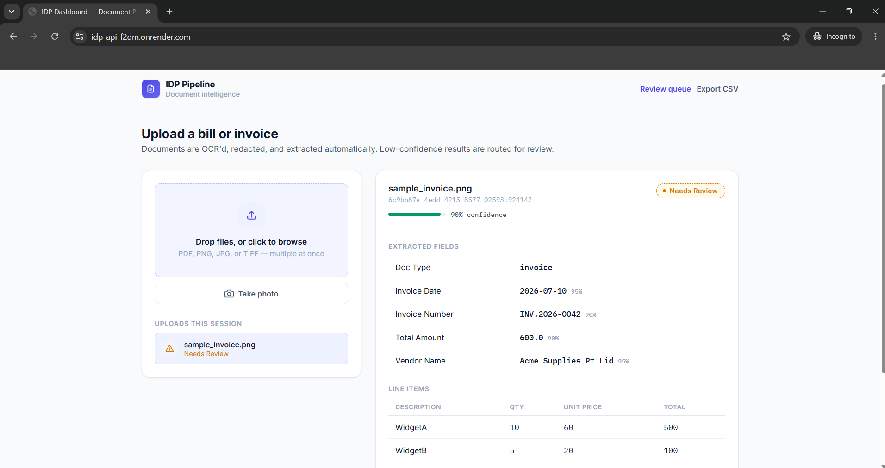
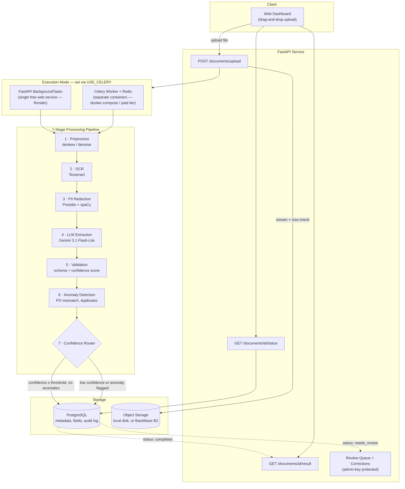

<div align="center">

# IDP Pipeline
### Intelligent Document Processing for Invoices, POs & Receipts

OCR → PII Redaction → LLM Extraction → Validation → Anomaly Detection → Human Review

[](https://www.python.org/)
[](https://fastapi.tiangolo.com/)
[](https://ai.google.dev/)
[](https://render.com)
[](#license)

[Live Demo](https://idp-api-f2dm.onrender.com) · [Architecture](#architecture) · [Quick Start](#quick-start) · [API Reference](#api-reference) · [Deployment](#deployment)

</div>

---

## What it does

Upload a bill, invoice, purchase order, or receipt — as a photo, scan, or PDF — and the pipeline:

1. **Extracts text** via OCR (Tesseract, with adapters for AWS Textract / Google Document AI)
2. **Redacts PII** (names, emails, phone numbers, card numbers) *before* anything touches an external LLM API or a log line
3. **Extracts structured fields** — vendor, invoice number, dates, totals, line items — using Google Gemini
4. **Validates & normalizes** the result against schema and business rules, producing a confidence score
5. **Detects anomalies** — PO mismatches, duplicate invoices, price deviations
6. **Routes automatically**: high-confidence, clean documents complete immediately; anything uncertain or flagged is queued for a human reviewer
7. **Captures corrections** from reviewers as a feedback dataset for future prompt refinement

<div align="center">


<sub>Live dashboard — extracted fields, line items, and confidence-based routing, all visible without touching the API directly.</sub>
</div>

---

## Architecture

The service runs in one of two shapes depending on where it's deployed — same pipeline code, different execution model.



**Why two execution modes:** Render's free tier only includes Web Services, Postgres, and Redis — not Background Workers. Rather than requiring a paid plan, the pipeline logic is a plain function (`run_pipeline()`) that either runs via Celery in its own worker container (local dev, or a paid deployment) or in-process via FastAPI's `BackgroundTasks` (the free deployment above). Same code path either way — see [`app/tasks.py`](app/tasks.py).

---

## Features

| | |
|---|---|
| 🧾 **Multi-document support** | Invoices, POs, and receipts — PDF, PNG, JPG, TIFF |
| 🔒 **PII-safe by design** | Redaction happens before the LLM call or any logging, not after |
| 🎯 **Confidence-based routing** | Only uncertain or anomalous documents reach a human |
| 🔁 **Human-in-the-loop feedback** | Corrections are captured for future prompt/model refinement |
| ⚡ **Streaming uploads** | Files are size-checked and written in chunks — never fully buffered in memory |
| 🚦 **Rate limited** | Per-IP upload limits protect against abuse on a public endpoint |
| 🗂️ **Pluggable storage** | Local disk for dev, Backblaze B2 (S3-compatible) for production |
| 📊 **Live dashboard** | Drag-and-drop upload, real-time status, extracted-field and anomaly views — no API client needed |

---

## Tech Stack

| Layer | Choice |
|---|---|
| API | Python 3.11 · FastAPI · Uvicorn |
| Async processing | Celery + Redis (local/paid) *or* FastAPI BackgroundTasks (free-tier) |
| OCR | Tesseract (pluggable adapter for AWS Textract / Google Document AI) |
| PII Redaction | Microsoft Presidio + spaCy (`en_core_web_sm`) |
| LLM Extraction | Google Gemini (`gemini-3.1-flash-lite`) |
| Database | PostgreSQL (SQLAlchemy + Alembic) — [Neon](https://neon.tech) in production |
| Object Storage | Local disk (dev) or [Backblaze B2](https://www.backblaze.com/cloud-storage) (production) |
| Deployment | Docker · [Render](https://render.com) (free tier) |

---

## Quick Start

### Docker (recommended)

```bash
cp .env.example .env
# edit .env and set GEMINI_API_KEY — get one at https://aistudio.google.com/apikey

docker-compose up --build
```

This starts `api` (http://localhost:8000, docs at `/docs`), `worker`, `postgres`, `redis`, and `flower` (Celery monitoring at http://localhost:5555).

### Local, no Docker

Requires Python 3.11+, PostgreSQL, Redis, and `tesseract-ocr` installed locally (`brew install tesseract` / `apt-get install tesseract-ocr`).

```bash
python -m venv venv && source venv/bin/activate   # Windows: venv\Scripts\activate
pip install -r requirements.txt
python -m spacy download en_core_web_sm

cp .env.example .env   # set DATABASE_URL, REDIS_URL, GEMINI_API_KEY

# terminal 1
uvicorn app.main:app --reload
# terminal 2
celery -A app.celery_app.celery_app worker --loglevel=info
```

Then open **http://localhost:8000** for the dashboard.

---

## API Reference

```bash
# Upload a document
curl -X POST http://localhost:8000/documents/upload \
  -F "file=@sample_invoice.pdf"
# → {"document_id": "...", "status": "pending"}

# Poll status
curl http://localhost:8000/documents/{document_id}/status

# Get the extracted result once completed / needs_review
curl http://localhost:8000/documents/{document_id}/result

# Review queue (requires X-Admin-Key once ADMIN_API_KEY is set)
curl http://localhost:8000/documents/review-queue \
  -H "X-Admin-Key: your-admin-key"

# Submit a human correction (also marks the doc completed, feeds the feedback loop)
curl -X POST http://localhost:8000/documents/{document_id}/review \
  -H "X-Admin-Key: your-admin-key" \
  -H "Content-Type: application/json" \
  -d '{"corrections": {"vendor_name": "Correct Vendor Pvt Ltd"}, "reviewer": "you"}'

# List all documents, optionally filtered by status
curl "http://localhost:8000/documents?status=completed" \
  -H "X-Admin-Key: your-admin-key"

# Export results as CSV or JSON (one row per document, all fields as columns)
curl "http://localhost:8000/documents/export?format=csv" \
  -H "X-Admin-Key: your-admin-key" -o documents_export.csv
```

Full interactive docs at `/docs` (Swagger UI) once the service is running.

### Reviewer UI

Open **`/review`** for a real screen for the human-in-the-loop half of the
pipeline: it lists everything in `needs_review`, shows *why* each doc was
flagged (validation errors, anomalies, low-confidence fields highlighted in
red), and lets you edit/confirm fields inline — no `curl` required. Paste
your `X-Admin-Key` at the top if you've set one.

### Optional webhook notifications

Set `WEBHOOK_URL` in your environment to get pinged (via a plain POST) when
a document finishes processing. Works with anything that accepts a JSON
payload for free — a Slack "Incoming Webhook" URL, a Discord channel
webhook, a Zapier "Catch Webhook" trigger. No code required beyond pasting
the URL; leave it blank to disable (default, no cost either way).

---

## Deployment

The live demo runs entirely on free tiers:

| Service | Provider | Why |
|---|---|---|
| Compute | [Render](https://render.com) (free Web Service) | Native Docker support; sleeps after 15 min idle, wakes on request |
| Database | [Neon](https://neon.tech) (free Postgres) | Genuine free-forever tier, unlike Render's own (30-day expiry) |
| Object Storage | [Backblaze B2](https://www.backblaze.com/cloud-storage) | S3-compatible, 10GB free, no credit card required |

To deploy your own copy:
1. Fork this repo and push it to your own GitHub account
2. Create a free Neon project → copy the Postgres connection string
3. Create a free Backblaze B2 bucket + application key
4. On Render, **New → Blueprint**, point it at your fork — it reads [`render.yaml`](render.yaml) and provisions the service
5. Fill in the secrets Render prompts for: `DATABASE_URL`, `GEMINI_API_KEY`, `B2_ENDPOINT_URL`, `B2_KEY_ID`, `B2_APPLICATION_KEY`, `B2_BUCKET_NAME`

`ADMIN_API_KEY` is auto-generated by Render — find it in the service's Environment tab to access the review-queue endpoints.

---

## Known Gaps

Being upfront about what's not production-hardened yet:

- **No end-user auth** — anyone with the link can upload (rate-limited, but not authenticated). Add real auth before any non-demo use.
- **`TextractEngine` / `DocumentAIEngine`** in `ocr.py` are stubs — only Tesseract is wired up end-to-end.
- **`_get_historical_unit_price`** in `anomaly_detection.py` is a stub — needs a rolling-average query once there's real historical line-item data.
- **Multi-page PDFs** aren't rasterized in `preprocessing.py` — add `pdf2image` for multi-page support.
- **Free-tier cold starts** — first request after 15 minutes idle takes 30-60 seconds.
- **Schema change**: this update adds a `validation_errors` column to `documents`. `init_db()` only creates *missing* tables (`create_all`), it won't alter an existing one — if you already have a deployed database, either drop/recreate it (fine for a demo dataset) or add the column manually: `ALTER TABLE documents ADD COLUMN validation_errors JSON;` (Postgres) — adjust the type for other databases. A fresh database (e.g. a brand-new Neon project) needs nothing extra.
- **Accounting software / QuickBooks / Xero, email ingestion, real Slack app integration, real user accounts (OAuth), signed upload URLs, and a real cloud OCR provider (Textract/Document AI)** are intentionally not included here — each of those needs *you* to create your own account and paste in your own credentials (even the free tiers require a signup), so they can't be wired in blindly. The webhook support above covers Slack/Discord notifications generically without needing a registered Slack app. If you want any of these built out with your own API keys, ask and it'll be added the same way as everything else here.

## Sample Data

For testing without real documents, the [SROIE dataset](https://rrc.cvc.uab.es/?ch=13) (scanned receipts with labeled fields) is a good public source.

## Running Tests

```bash
pytest tests/ -v
```

`test_validation.py` covers validation logic in isolation — no DB/Redis/LLM required.

## Project Layout

```
app/
├── main.py                 # FastAPI routes
├── celery_app.py           # Celery config
├── tasks.py                # Pipeline orchestration (run_pipeline + Celery wrapper)
├── services/
│   ├── preprocessing.py    # deskew/denoise
│   ├── ocr.py               # OCR adapter (Tesseract / Textract / Document AI)
│   ├── pii_redaction.py     # Presidio-based PII redaction
│   ├── llm_extraction.py    # Gemini-based structured extraction
│   ├── validation.py        # schema + business-rule validation, confidence scoring
│   ├── anomaly_detection.py # PO mismatch / duplicate / price-deviation checks
│   ├── storage.py           # local disk / Backblaze B2 abstraction
│   ├── notify.py            # optional outbound webhook notifications
│   └── db.py                # DB session + query helpers
├── models/db_models.py     # SQLAlchemy ORM models
├── schemas/api_schemas.py  # Pydantic request/response models
├── static/index.html       # Upload dashboard UI
├── static/review.html      # Human-in-the-loop review UI
└── core/                   # config + logging
tests/
```

## License

MIT
